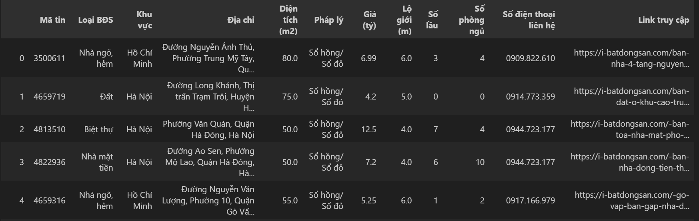

# **Housing Price Prediction in Vietnam**  
### **1. Objective**  
In this project, I aim to access the website https://i-batdongsan.com/ to collect data on real estate properties across provinces and cities in Vietnam. After gathering the data, our main objective is to analyze it and use various Machine Learning models to predict house prices. Additionally, we will incorporate the processed data into PowerBI to gain a more visual insight into the housing price situation in different areas with the collected dataset.  
### **2. Implementation Steps**  
1. Data Crawling from the website:  
I utilize libraries such as bs4 and selenium to retrieve the data.  
2. Data Preprocessing:  
After going through data preprocessing steps, I obtain a data table as follows:  

3. Data Visualization  
Using Matplotlib library for visualization before feeding into the machine learning models.  
4. Training basic machine learning models  
The three models I employ here are:  
- Linear Regression  
- XGBoost Regression  
- GradientBoostingRegressor  
5. PowerBI  
Analysis and visualization based on PowerBI plots.